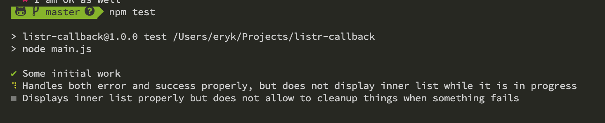

listr-callback
==============

Run tests to see an actual output. Task names will tell you the story.

```
npm test
```

When the inner list is imperatively runned and `await`ed to handle an error,
the UI doesn't look as expected - only the title from the outer list shows up.


